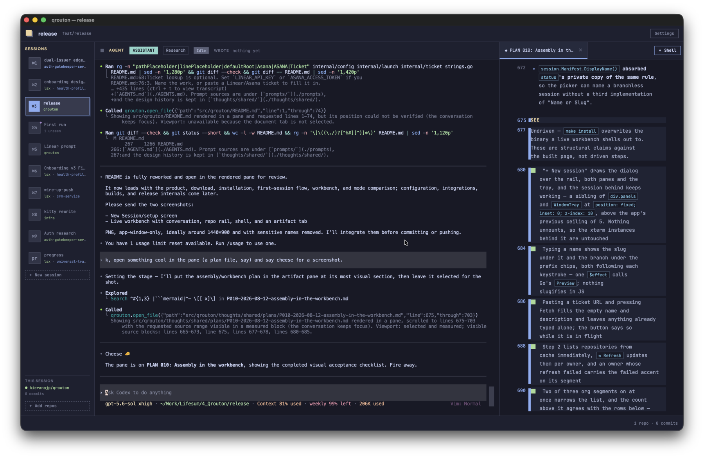
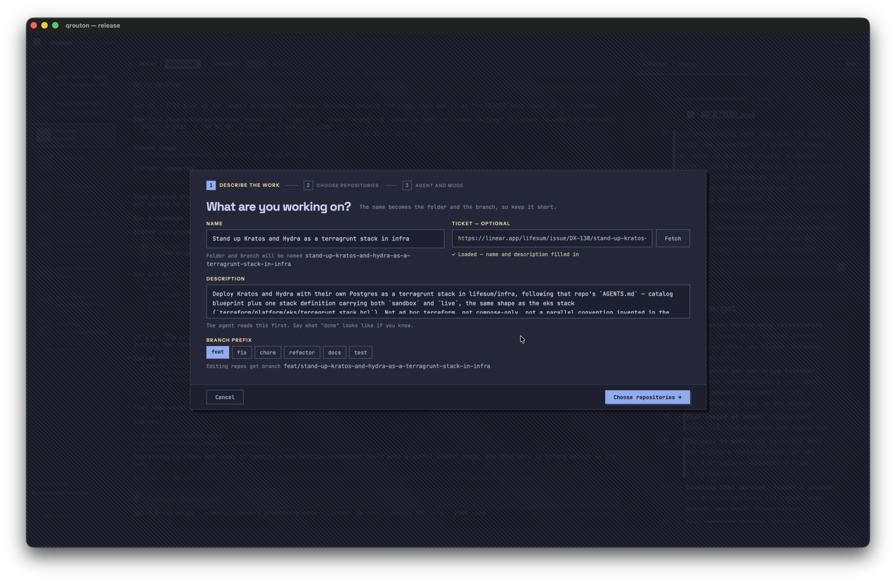

<p align="center">
  
</p>

<h1 align="center">qrouton</h1>

<p align="center">
  <strong>A desktop workbench for coding-agent sessions that cross repository boundaries.</strong>
  <br>
  Pick the repos. Set their roles. Choose an agent. Start working.
</p>

<p align="center">
  <a href="https://github.com/kieranajp/qrouton/actions/workflows/ci.yml"></a>
  <a href="https://github.com/kieranajp/qrouton/releases/latest"></a>
</p>

<p align="center">
  <a href="https://github.com/kieranajp/qrouton/releases/latest"><strong>Download qrouton for macOS</strong></a>
</p>

Most engineering work does not fit neatly inside one repository. A product
change can touch an app, a service, a shared library, and a set of design or
architecture notes. qrouton assembles those pieces into one durable workspace
and runs the coding agent inside it.

It handles the plumbing—mirrors, worktrees, branches, instructions, process
supervision, and conversation resume—while you and the agent share one desktop
workbench.



## What you get

- **One session across many repositories.** Editing repos get a session branch;
  reference repos are pinned, detached, and read-only.
- **A workbench you can drive together.** The agent conversation, a real shell,
  live commands, documents, diffs, and status all live in one window.
- **Your choice of agent.** Claude Code, Codex CLI, and OpenCode are supported.
- **Two ways to work.** Use Assistant mode for ordinary collaboration, or RPI
  for a structured Research → Plan → Implement run.
- **Sessions that survive.** Reopen a session and qrouton restores its repos,
  mode, branch, and agent conversation.
- **Less repeated cloning.** Shared bare mirrors feed lightweight worktrees for
  every session.

## Install on macOS

The release bundle supports Apple silicon and Intel Macs running macOS 12 or
newer.

1. Download the latest zip from [GitHub Releases](https://github.com/kieranajp/qrouton/releases/latest).
2. Unzip it and move `qrouton.app` to Applications.
3. Control-click the app, choose **Open**, then confirm **Open** on first launch.

> [!NOTE]
> Release builds are currently ad-hoc signed, so macOS shows an
> unidentified-developer warning on first launch. Developer ID signing and
> notarisation are supported by the release workflow but not configured yet.

qrouton expects these tools on the Mac:

- [Git](https://git-scm.com/)
- [GitHub CLI](https://cli.github.com/), authenticated with `gh auth login`, or
  a `GITHUB_TOKEN`
- At least one supported agent: `claude`, `codex`, or `opencode`

Ticket lookup is optional. Set `LINEAR_API_KEY` or `ASANA_ACCESS_TOKEN` if you
want a pasted ticket link to populate the session name and description.

## Create your first session

1. Open **Settings** and add the GitHub organisations or users whose repos you
   want to search.
2. Choose **+ New session**.
3. Name the work, or paste a Linear/Asana ticket to fill it in.
4. Choose a branch prefix, agent, and session mode.
5. Set each repository to **Editing**, **Reference**, or **Off**.
6. Create the session. qrouton assembles it and starts the agent in the
   workbench.



Repositories have deliberately different roles:

| Role | What qrouton does | What the agent may do |
| --- | --- | --- |
| **Editing** | Checks out `<prefix>/<session-slug>` | Read and change files |
| **Reference** | Pins a detached commit | Read only |
| **Off** | Leaves the repository out | Nothing |

You can add more repositories later without restarting the conversation.

## The workbench

The conversation is the main surface, not a dashboard wrapped around it.
qrouton runs the selected agent in a real PTY and gives it session-aware tools
for opening supporting work beside the conversation.

An agent can:

- open a Markdown plan or research document;
- show the current diff;
- run a build, watcher, server, or log tail in an interactive tab;
- open a source file in your configured editor;
- ask for more repositories when the task expands.

Agent-opened tabs do not steal keyboard focus. Commands that succeed close
their tab; failed commands stay visible with their error.

## Assistant and RPI modes

| | Assistant | RPI |
| --- | --- | --- |
| Best for | Questions, diagnosis, small changes, open-ended collaboration | Larger or ambiguous work that benefits from explicit phases |
| Flow | Work directly | Research → Plan → Implement |
| Delegation | Used only when helpful | Leads fan out to focused specialists |
| Durable artifacts | Optional | Research, specs, and plans are part of the workflow |

RPI is qrouton's structured orchestration loop: research establishes what is
true, planning turns it into a tactical design, implementation executes and
verifies it. Assistant mode keeps the same workbench and tools without forcing
that ceremony.

A session can escalate from Assistant to RPI mid-conversation. The mode and its
prompt assets are stored with the session and restored when it resumes.

## Sessions on disk

```text
<root>/
├── .mirrors/<owner>/<repo>.git
└── <session>/
    ├── qrouton.json
    ├── src/
    │   ├── editing-repo/
    │   └── reference-repo/
    ├── thoughts/shared/
    └── .qrouton/
```

Mirrors are shared across sessions. Worktrees, the manifest, agent discovery
files, and durable thoughts belong to the session.

## Configuration

Configuration lives at `$XDG_CONFIG_HOME/qrouton/config.json`, falling back to
`~/.config/qrouton/config.json`.

```json
{
  "orgs": ["lifesum", "vimeda", "kieranajp"],
  "root": "~/work/qrouton",
  "editor": ["code", "--goto", "{path}:{line}"],
  "launch": {
    "claude": ["claude", "--dangerously-skip-permissions", "--verbose"]
  }
}
```

| Key | Purpose |
| --- | --- |
| `orgs` | GitHub organisations or personal accounts shown in the repo picker |
| `root` | Sessions root; defaults to `~/work` |
| `editor` | Optional editor argv; `{path}` is required and `{line}` is supported |
| `launch` | Optional exact argv override keyed by `claude`, `codex`, or `opencode` |

`launch` replaces the built-in command; it does not append flags. An override
may use an absolute executable path to point qrouton at a beta or local build.

Finder-launched app bundles add the conventional Homebrew and per-user CLI
directories to `PATH`, keeping `gh`, agents, and editor commands discoverable.

Useful command-line options:

```sh
qrouton --runner codex
qrouton --linear-issue LIF-2841
```

## Linear Desktop integration

Linear Desktop can send **Work on issue → Custom script** into qrouton's New
session flow.

1. Open qrouton's **Settings**.
2. Find **Linear custom script**.
3. Save the prefilled JSON to `~/.linear/coding-tools.json`.

The generated entry points Linear at the running qrouton executable:

```json
{
  "openIssue": {
    "path": "/Applications/qrouton.app/Contents/MacOS/qrouton",
    "args": ["--linear-issue", "{{issue.identifier}}"],
    "env": ["LINEAR_PROMPT"]
  }
}
```

The issue opens in a new-session draft. Linear's composed prompt is delivered
once, after qrouton's own opening message, when the agent first starts.

`LINEAR_API_KEY` must be available to the qrouton process. A workbench that is
already running keeps the environment it started with.

## Build from source

Source builds require Go 1.26+, Node 22+, and the platform WebKit development
libraries. There is no Windows build.

```sh
make build
./qrouton
```

`make install` writes the binary to `~/.local/bin` by default. Override that
with `BINDIR=/somewhere make install`.

On Linux, install GTK4 and WebKitGTK 6 first:

```sh
# Debian / Ubuntu
sudo apt install libgtk-4-dev libwebkitgtk-6.0-dev

# Arch
sudo pacman -S webkitgtk-6.0
```

Build the macOS bundle and universal release archive with:

```sh
make app
make dist VERSION=0.1.0
```

## Releases

Creating a non-draft GitHub Release with a numeric tag such as `v0.1.0`
triggers the release workflow. CI builds a universal `.app`, verifies it,
archives it, and uploads the zip and checksum to that Release.

To enable Developer ID signing and notarisation, configure:

- `MACOS_CERTIFICATE` — base64-encoded Developer ID Application `.p12`
- `MACOS_CERTIFICATE_PASSWORD`
- `MACOS_SIGNING_IDENTITY`
- `APPLE_ID`
- `APPLE_TEAM_ID`
- `APPLE_APP_SPECIFIC_PASSWORD`

Without those secrets the workflow deliberately produces an ad-hoc signed
bundle.

## Contributing

Run the complete gate before handing work over:

```sh
GOCACHE=/tmp/qrouton-go-cache make check
```

That covers Go tests, the race detector, vet, the production build, formatting,
Svelte checks, unit tests, and browser tests.

The repository's working agreement and architecture live in
[`AGENTS.md`](./AGENTS.md). Prompt sources are under [`prompts/`](./prompts),
and the design history is kept in [`thoughts/shared/`](./thoughts/shared/).
