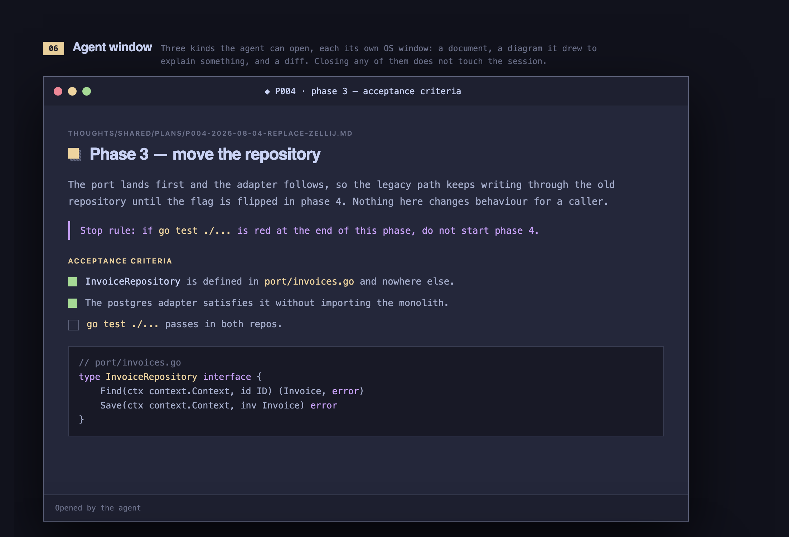

<p align="center">
  
</p>

<p align="center">
  <strong>A harness for your harnesses.</strong>
</p>

<p align="center">
  <a href="https://github.com/kieranajp/qrouton/actions/workflows/ci.yml"></a>
  <a href="https://github.com/kieranajp/qrouton/releases/latest"></a>
</p>

<p align="center">
  <a href="https://github.com/kieranajp/qrouton/releases/latest"><strong>Download qrouton for macOS and Ubuntu</strong></a>
</p>

<p align="center">
  or <code>brew tap kieranajp/qrouton https://github.com/kieranajp/qrouton && brew install --cask qrouton</code>
</p>

A product change touches the app, a service, a shared library and a folder of
architecture notes. Your agent sees one of those, and forgets the lot when the
conversation dies.

qrouton is a desktop workbench that wraps the agent you already use - Claude
Code, Codex CLI or OpenCode - and hands it the whole picture. It does three
things today, with a fourth on the way.


## 1. Every repo the work touches, on worktrees

Sessions start empty and pick up repositories as you discover you need them.
Each one gets a git worktree cut from a shared bare mirror, and a role:

| Role | What the agent may do |
| --- | --- |
| **Editing** | Read and write, on a session branch |
| **Reference** | Read a pinned commit, and nothing else |

Reference is the role that earns its keep. You're changing the frontend and the
agent needs the backend's API contract: give it the service read-only and it can
go and look, with no chance of a helpful little fix landing in a repo you
weren't working in.

Repositories can join mid-conversation. Nothing restarts.


## 2. The agent shows you things

Most agent output is a wall of text describing something you'd rather just look
at. qrouton gives the agent tools to open a panel beside the conversation, and
the prompts push it to use them:

- test suites, builds, dev servers and log tails in an interactive tab - Ctrl-C
  there reaches the process;
- rendered plans and research documents, opened on the line under discussion;
- d2 diagrams, so a concept gets drawn rather than narrated;
- the current diff, across every repo in the session.

There's a Svelte engine under the bonnet, so a panel can show just about
anything, interactive elements included. A command that exits cleanly takes its
tab with it; one that fails keeps the tab, so the error stays readable. None of
it steals your keyboard.



## 3. A guided workflow, when the work deserves one

qrouton ships a Research → Plan → Implement loop: research establishes what's
true, planning turns that into a tactical design, implementation executes it and
verifies each phase. I mainly built this bit to keep a workflow consistent
across a team.

It doesn't impose the loop, because the loop isn't right for every task. You
choose at the start: a plain agent session, or the guided one. Start plain, and
when the work turns out to be bigger than it looked, escalate mid-conversation -
the agent will suggest it when it reckons the time has come. Research, specs and
plans land in `thoughts/shared/` as files, so the thinking outlives the
conversation that produced it.

Two things qrouton does enforce, in both modes: worktrees, and heavy delegation
to subagents, so the context you're talking to stays lean.

## 4. Next

- **Artefact hosting in a knowledge graph.** Research and plans shared with your
  team across sessions and across repos, instead of sitting in one person's
  `thoughts/` directory.
- **Cross-family subagents.** Start a session on Opus today and every subagent
  beneath it is an Anthropic model. A specialist doing a bounded lookup has no
  business being tied to the orchestrator's family.

Both are planned. Neither is built.

## Odds and ends

Paste a Linear, Asana or GitHub ticket into a new session and it names and
describes itself, seeding the branch from the issue where the provider has an
identifier to seed it with. Linear Desktop can hand an issue straight to qrouton
through **Work on issue**, and `qrouton --ticket <url>` does the same for any of
the three from a terminal. Reopen a session weeks later and the repos, branches,
mode and agent conversation come back.

## Ubuntu installation

The Debian package supports **Ubuntu 24.04 on amd64 (x86-64)**. Download the
`.deb` and `checksums-linux-amd64.txt` from the same
[GitHub release](https://github.com/kieranajp/qrouton/releases/latest). In their
download directory, replace the example version below with the downloaded version:

```sh
sha256sum -c checksums-linux-amd64.txt
package=./qrouton_1.2.3_amd64.deb
sudo apt-get update
sudo apt-get satisfy -y "$(dpkg-deb --field "$package" Depends)"
sudo dpkg -i "$package"
```

`dpkg -i` needs the declared dependencies installed first. As a convenience,
`sudo apt install ./qrouton_1.2.3_amd64.deb` resolves and installs them together
with qrouton. Launch **qrouton** from the application menu or run `qrouton` in a
terminal. To check the installed package version, run `dpkg-query -W qrouton`.

Install a supported agent CLI separately: Claude Code, Codex CLI, or OpenCode.
Application-menu launches inherit the desktop's `PATH`, so the CLI must be
available there. GitHub authentication accepts `GITHUB_TOKEN`; the `gh` CLI is
optional. Finder reveal and Linear Desktop integration are unsupported on
Ubuntu. Native window decoration may appear alongside qrouton's own chrome.

## Building the Ubuntu package

Build natively on Ubuntu 24.04 amd64 with the Go version in `go.mod` and Node 22:

```sh
sudo apt-get update
sudo apt-get install -y build-essential pkg-config libgtk-4-dev libwebkitgtk-6.0-dev dpkg-dev desktop-file-utils
make deb VERSION=v1.2.3
(cd dist && sha256sum -c checksums-linux-amd64.txt)
```

This builds the frontend and writes `dist/qrouton_1.2.3_amd64.deb` plus
`dist/checksums-linux-amd64.txt`. A leading `v` is optional. With Docker running,
`make deb-check VERSION=v1.2.3` also checks package contents and tests installation,
reinstallation, and removal in a fresh Ubuntu container. It does not install
qrouton on the build host; its display-free `--help` check does not verify the GUI.

Building, testing, configuring and releasing this thing are documented in
[`AGENTS.md`](./AGENTS.md), for the agent. Prompt sources live in
[`prompts/`](./prompts) and the design history in
[`thoughts/shared/`](./thoughts/shared/).
